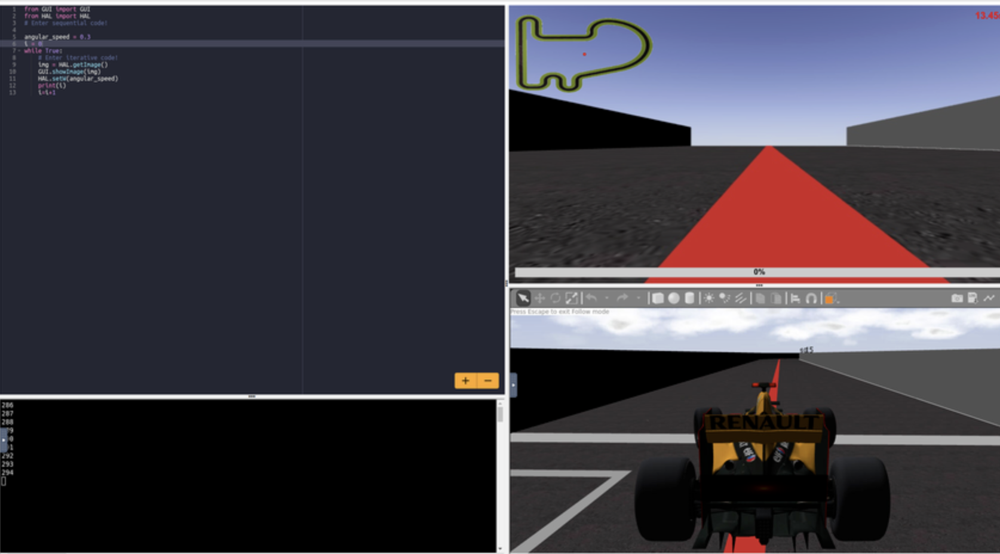

# Line Follower Robot - Control Systems Lab Report

## Project Overview

This project implements a line follower robot using computer vision and different control algorithms. The robot is designed to follow a red line by processing camera input and adjusting its movement accordingly. Three different control strategies have been implemented and tested: Proportional (P), Proportional-Derivative (PD), and Proportional-Integral-Derivative (PID) controllers.

## Table of Contents

- [How It Works](#how-it-works)
- [Control Algorithms](#control-algorithms)
- [Implementation Details](#implementation-details)
- [Performance Analysis](#performance-analysis)
- [Screenshots](#screenshots)
- [Usage Instructions](#usage-instructions)
- [Dependencies](#dependencies)

## How It Works

The line follower robot operates using the following process:

1. **Image Acquisition**: The robot captures images from its camera using `HAL.getImage()`
2. **Color Detection**: The image is converted to HSV color space and a red color mask is applied to isolate the line
3. **Line Detection**: Contours are found in the masked image to identify the line
4. **Centroid Calculation**: The moment-based centroid of the largest contour (line) is calculated
5. **Error Calculation**: The horizontal error is computed as the difference between the image center (320 pixels) and the line centroid
6. **Control Signal Generation**: Based on the error, different control algorithms generate appropriate steering commands
7. **Motor Control**: The robot adjusts its linear velocity (v) and angular velocity (w) to follow the line

### System Architecture

```
Camera Input → HSV Conversion → Red Mask → Contour Detection → Centroid → Error → Controller → Motor Commands
```

## Control Algorithms

### 1. Proportional Controller (P-Controller)

**File**: `proporcional.python`

The simplest controller that generates output proportional to the current error:

```
Control Signal = Kp × Error
```

**Parameters**:
- `kp = 0.005`: Proportional gain

**Characteristics**:
- Simple implementation
- Can be unstable with high gains

### 2. Proportional-Derivative Controller (PD-Controller)

**File**: `pd.python`

Adds derivative control to reduce overshoot and improve stability:

```
Control Signal = Kp × Error + Kd × (Error - Previous_Error)
```

**Parameters**:
- `kp = 0.005`: Proportional gain
- `Kd = 0.0001`: Derivative gain

**Characteristics**:
- Better stability than P-controller
- Reduces overshoot

### 3. Proportional-Integral-Derivative Controller (PID-Controller)

**File**: `pid.python`

The most complete controller that includes integral action to eliminate steady-state error:

```
Control Signal = Kp × Error + Ki × ∫Error + Kd × (Error - Previous_Error)
```

**Parameters**:
- `kp = 0.005`: Proportional gain
- `Ki = 0.0001`: Integral gain
- `Kd = 0.000001`: Derivative gain

**Characteristics**:
- Eliminates steady-state error
- Includes integral windup protection (reset when error_sum > 200)
- Harder to stabilize.

## Implementation Details

### Computer Vision Pipeline

1. **Color Space Conversion**: RGB to HSV for better color detection
   ```python
   hsv = cv2.cvtColor(img, cv2.COLOR_BGR2HSV)
   ```

2. **Red Line Detection**: HSV range filtering
   ```python
   red_mask = cv2.inRange(hsv, (0,125,125), (30,255,255))
   ```

3. **Contour Analysis**: Finding and analyzing line contours
   ```python
   contours, hierarchy = cv2.findContours(red_mask, cv2.RETR_TREE, cv2.CHAIN_APPROX_SIMPLE)
   ```

4. **Centroid Calculation**: Using image moments
   ```python
   M = cv2.moments(contours[0])
   cX = M["m10"] / M["m00"]
   cY = M["m01"] / M["m00"]
   ```

### Adaptive Velocity Control

All controllers implement adaptive velocity control:
- **High Speed** (`v = 8`): When steering correction is minimal (`|w| < 1`)
- **Low Speed** (`v = 1`): When significant steering is required (`|w| ≥ 1`)

This ensures stable line following while maintaining reasonable speed.

## Screenshots


## Usage Instructions

### Running with Unibotics Platform

This project is designed to run on the Unibotics robotics platform, which provides a simulated environment for testing line following algorithms.

#### Prerequisites

1. Docker installed on your system
2. GPU support enabled (for better performance)
3. Access to display server (for visualization)

#### Setup and Execution

1. **Start the Unibotics Backend**:
   
   Run the following Docker command to start the robotics backend:
   ```bash
   docker run --rm -it --device /dev/dri --gpus all \
     -p 6080-6090:6080-6090 -p 7163:7163 jderobot/robotics-backend:latest
   ```


2. **Access the Unibotics**:
   
   After running the Docker command, open your web browser and navigate to:
   ```
   https://unibotics.org
   ```

   Login and Go to Free Course -> Follow Line

3. **Load and Run Controllers**:
   
   In the Unibotics interface:
   - Load the desired Python file (`proporcional.python`, `pd.python`, or `pid.python`)
   - Start the simulation


## Dependencies

- **HAL**: Hardware Abstraction Layer for robot control
- **WebGUI**: Web-based visualization interface
- **OpenCV (cv2)**: Computer vision library
- **Frequency**: Timing control (optional)

## Conclusion

This project demonstrates the implementation and comparison of three fundamental control strategies for autonomous line following. The progression from P to PD to PID controllers shows increasing complexity and performance, providing valuable insights into control system design for mobile robotics applications.

## Authors

- Student Name: Gastón Tognola
- Institution: UJI
- Date: November 2025